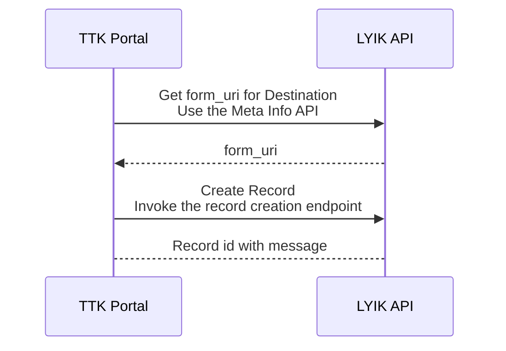
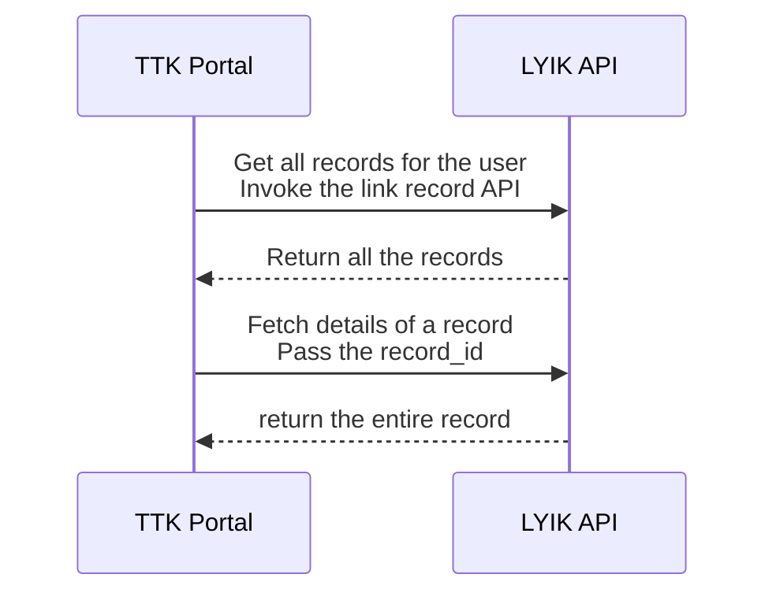

# Data Integration

LYIK and TTK systems will constantly exchange data and there needs to be fixed protocol and API endpoints to exchange data. The following are the envisaged integration points

## Token Exchange
All LYIK API are protected by LYIK Tokens. Hence its imperative that the TTK system obtain the equivalent token for all operations. Tokens have to be obtained for all types of users as certain operations are allowed by only certain types of users.
For instance users with only `client` and `maker` roles can create a travel record. Only a `back office admin` will be able to modify parts of the record after the record is validated by the `checker`.
### API Endpoint

> TODO: Provide the details of the `/v1/token` endpoint

### TTK Token
The format of the TTK token that will be exchanged for the LYIK Token will be fixed. The token should, at a minimum, contain the following information
1. Digital Identifier (`id`)
	1. This should be the digital identifier, such as mobile number or email address or even a user id, that is used to identify the logged in user uniquely in the system.
	2. The digital identifier is used by the LYIK system to fetch the relevant records.
	3. For example: If the `id` is a mobile number, the only the records that are associated with that mobile number are fetched.
	4. It's strongly suggested that a human actor (be it the client or any TTK employee) be identified by one and only one `id`
	5. This means a client should not be allowed to be identified by both `mobile` and `email`
2. Role
	1. The role of the user that is to be logged into the system
	2. LYIK can recognise the following roles
		1. `client`
		2. `maker`
		3. `parent_maker`
		4. `checker`
		5. `parent_checker`
		6. `bo_admin`
3. Name
	1. This is the name of the user
	2. This will be used for display purpose only

### Format of the TTK Token

> [!NOTE] Attention Baskar
> What is the format of the token ?
> Will the token be encrypted or encoded ?
> Will the token be self contained or should the details be fetched from an API endpoint
> Will the format of the token be similar for `clients` and `TTK Employees`

### Format of the LYIK Token
> NOTE: Provide the details of the LYIK Token.
>

## Create Travel Record
TTK will create the travel records for each traveller in the LYIK system the very first time. These travel records will contain some very basic information that will enable the `client` to start the visa application digital journey. The `maker` can also assist the client with the journey.
### Travel Record 
The data required to create the travel record will be common for any type of visa application and for any country. This is the basic data that gets collected by the `client` at the beginning of the journey in the TTK Portal. The format of the data will be a `json` document the structure of which is given below
#### The Record JSON document
> TODO: GIve a sample JSON document

### API Endpoint to create the record
> TODO : Provide the details of the `/v1/forms/{uri}` endpoint 

### The flow to create a travel record
Below is the flow diagram to create the a new record. The highlights are as follows
1. As already stated its imperative to get the `LYIK Token` for invocation of any API
2. The TTK Portal first invokes a `meta information API` to fetch the list of all forms available in the system OR ask for the meta information of a particular form identified by its name
	1. The meta information returns the `form_uri` which uniquely identifies a form in the LYIK platform
3. The TTK Portal will then create a new record for the particular form by invoking the record creation endpoint for the form identified by the `form_uri`

## Fetch Form Meta Information
There are few instances where the TTK infrastructure will need to get some meta information about a form. The TTK system will recognise a form by its `name` and will fetch the information from the LYIK system.

> [!info] Map by Form Name
> The TTK system needs to maintain a list of the form names created in the LYIK system. It may chose to map the `form name` to the destination country (or the country for which Visa is being applied for).

> NOTE: Document the API to fetch form meta information

## Get travel record
The TTK back office or even the TTK portal will at times need access the travel record in the LYIK system. To get the record of a particular traveller the TTK System will have to first query all the records associated with the user and then pick the one record for which the detailed information is needed. With in the LYIK platform, each record is uniquely identified by a `record_id`. The details of a record can only be fetched using the `record_id`

Here the user can be `client`, `maker` or `checker`. If its the `client`, the records associated with only that particular user will be fetched. If its the `maker` then all traveller records associated with that `maker` can be fetched and so on.

