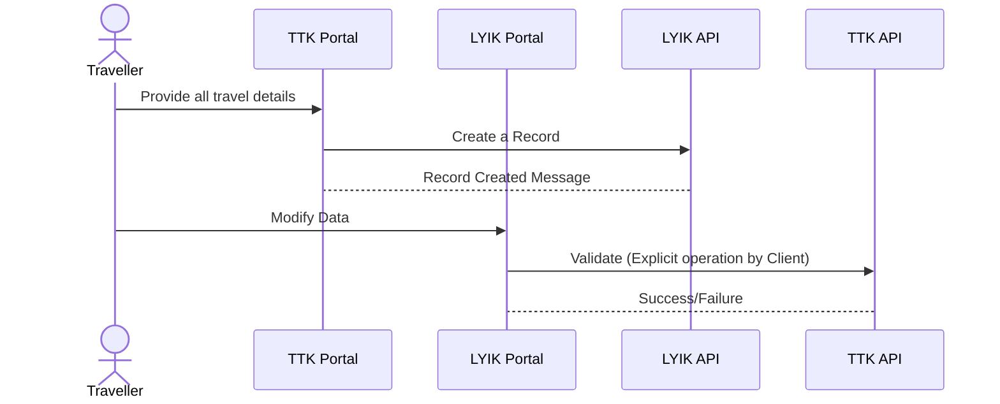

## Notes
These are relevant to the `Travel Details` section
1. At the time of creation of the Record, the data given by the TTK Portal need not be validated by any TTK API
	1. Here its assumed that the data is already sanitised
2. When the client modifies the data in this section, there will be a `verification` that needs to happen which will invoke the TTK API to validate the data

### Verification Logic
1. The `verifier` will invoke the TTK API to get the validity of the data
	1. The `TTK API` will always need the `order_id` to perform data validations
	2. The API will be `state` aware and hence need not be passed the previous and current states
2. The `client` will always have to keep a checkbox checked to approve the data being processed
3. The `client` will indicate the residence province/state (Karnataka, Kerala etc)