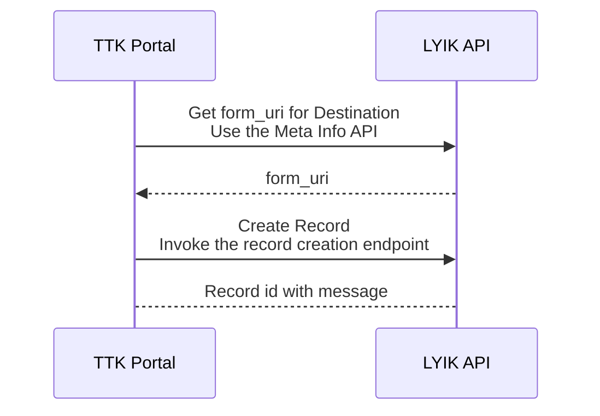
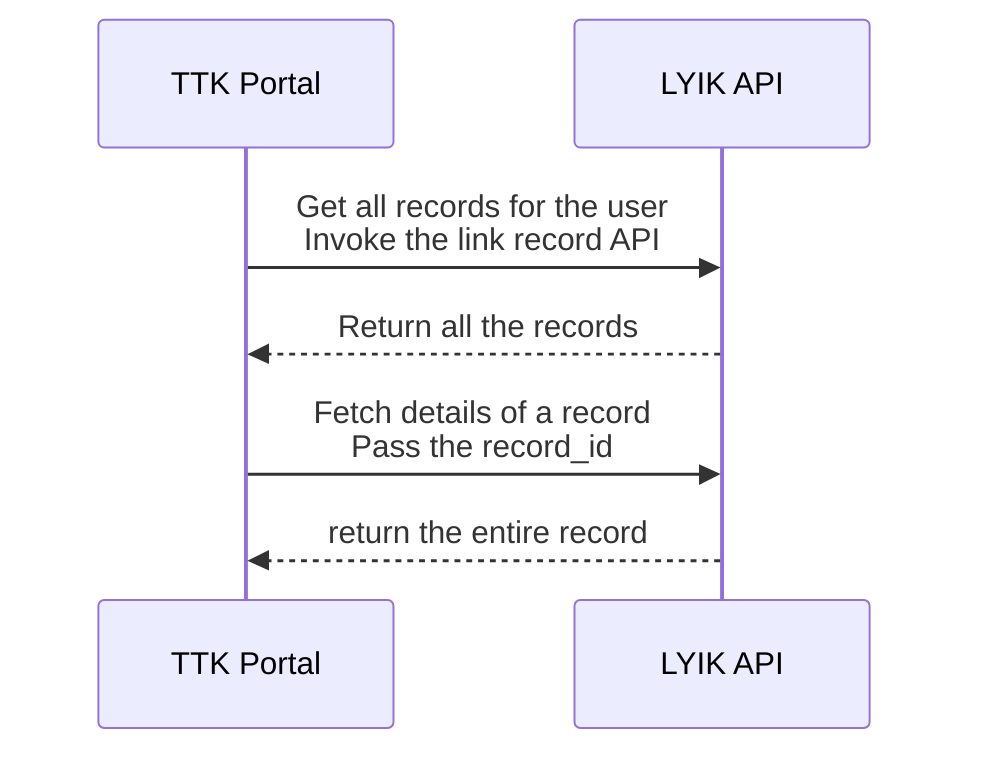

# About Travel Record
As per the design, the traveller (client) will first login to the TTK portal and then the TTK Portal will transition the user to the LYIK portal. Before the transition, its necessary that the TTK Portal will create a travel record for each of the travellers. This document talks about this flow
## Create Travel Record
TTK will create the travel records for each traveller in the LYIK system the very first time. These travel records will contain some very basic information that will enable the `client` to start the visa application digital journey. The `maker` can also assist the client with the journey.
### Travel Record 
The data required to create the travel record will be common for any type of visa application and for any country. This is the basic data that gets collected by the `client` at the beginning of the journey in the TTK Portal. The format of the data will be a `json` document the structure of which is given below
#### The Record JSON document
> TODO: The JSON sample can be derived from the form once the form is created

### API Endpoint to create the record
The endpoint to create the record will be `/v1/forms/{uri}` where uri is the unique resource identifier for the form. The URI for a form can be fetched by fetching the meta data for a form. See below for more information

### The flow to create a travel record
Below is the flow diagram to create the a new record. The highlights are as follows
1. As already stated its imperative to get the `LYIK Token` for invocation of any API
2. The TTK Portal first invokes a `meta information API` to fetch the list of all forms available in the system OR ask for the meta information of a particular form identified by its name
	1. The meta information returns the `form_uri` which uniquely identifies a form in the LYIK platform
3. The TTK Portal will then create a new record for the particular form by invoking the record creation endpoint for the form identified by the `form_uri`

## Fetch Form Meta Information
There are few instances where the TTK infrastructure will need to get some meta information about a form. The TTK system will recognise a form by its `form_name` and will fetch the information from the LYIK system.

> [!info] Map by Form Name
> The TTK system needs to maintain a list of the form names created in the LYIK system. It may chose to map the `form name` to the destination country (or the country for which Visa is being applied for).

The API endpoint to get the `form_uri` for a given `form_name` is `/v1/mgmt/forms/formdata`. The details of the API can be got from the swagger docs in a running instance of the LYIK platform.

## Get travel record
The TTK back office or even the TTK portal will at times need access the travel record in the LYIK system. To get the record of a particular traveller the TTK System will have to first query all the records associated with the user and then pick the one record for which the detailed information is needed. With in the LYIK platform, each record is uniquely identified by a `record_id`. The details of a record can only be fetched using the `record_id`

Here the user can be `client`, `maker` or `checker`. If its the `client`, the records associated with only that particular user will be fetched. If its the `maker` then all traveller records associated with that `maker` can be fetched and so on.

### The API for fetching form records
The API to fetch all the records for a given user is `/v1/forms/linkrecord`. 
The API to fetch a particular record is `/v1/forms/{uri}`. This API takes an `id` as input. If the `id` is given then the record for that id too is fetched.