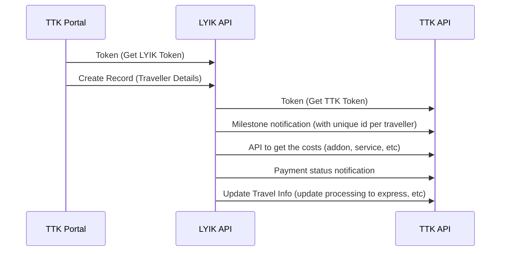

# 11 April 2025
## Meeting Information

**Meeting Date/Time:** 2025-04-07 / 10:00 AM

**Meeting Location:** TTK Office, Marathahalli 

**Note Taker:** Akhil Babu

---
---
## Attendees

- Vishnu
- Baskar
- Sundar
- Akhil Babu
- Suveer N

- ---
- ---

## Agenda Items

1. Complete the Form Structure

---
---

## Discussion Items

### B2C Journey:
1. Digital identity is always the mobile number

### B2B Journey:
1. Digital Identity is always the corporate email address (@lyik.com)
2. SPOC - Corporate employee for visa processing (Not TTK Employee)
	1. SPOC will add the employee details, email id, name, id, etc.
3. Client (traveller) Whitelisted in the ttk system by the SPOC
4. If the client want to travel with family members the request has to be raised from the B2C portal? (Not confirmed)
5. The Client now has two different Digital identities.

---
### Form Structure

1. Multiple bank statements, Salary slips
2. ITR for 3 different documents (last 3 years)(3-6 document limit)
3. Additional tab for employer documents (SPOC) (only for B2B)

---

### States of Document:

The following states are already defined.

1. SAVE
2. SUBMIT
3. DISCREPANCY
4. APPROVED
5. COMPLETED

	 There can by any number of states between APPROVED and COMPLETED

---
### Actors, Roles
1. Maker and Client are peers.
2. Weights determine if they can override the others data or not.
3. Visibility settings based on personality. Maker, Client visibility can vary.
	1. There can be rules for sections to be visible or not based on the user type.

---
### Communication Between Maker and Checker:
1. Currently done with email.
2. What is the best way for them to exchange thoughts, and keep track of the conversation (phase 1 or 2, to be planned)

---
### Client Journey
1. Client is the one who logs in. (similar to DIY)
2. Maker association
	1. Maker is assigned when the client is logged in (Round Robin)

---
### Notifications and Verifications
1. For every operation done by the client, LYIK can inform TTK API about the state change, and the TTK API can decide how, and when to notify a customer.
2. Verifier can check for date change, is it allowed, etc, and decide to notify or not.
3. All data can be verified with external entity (TTK portal), verifiers can we made for this.
4. Travel information Verification is per day basis. The client will have to verify the information they have to verify at regular intervals, in-case it is changed.

---
### API Integration
1. Interaction between TTK Portal, LYIK Portal, TTK API, LYIK API

---
### DATA for a Form

Every VISA Form will have some standard fields such as
1. Departure Date
2. Arrival Date
3. Destination
4. Departure
5. Processing Type (Express/Normal)
6. Type of Visa
7. Visa Mode
8. Length of Stay
9. Validity 
10. Entry (multiple)

---
### Progress Bar
1. Progress Bar % is based on the visible sections for that user.
2. If the section is completed, (and auto verification) then that is taken as a completed section
3. The total progress is completed_sections / total_visible_sections

---
### Checklist
1. Any additional documents will be added to attachments section, with appropriate description. There will ideally not be any modifications to the form, unless there is a much larger change which will affect all new applicants.
2. Possibility of multiple attachment of documents.

---
### Notes:
1. The TTK platform will not send any checklist items, they are predefined by the form created for that visa, country, date combination.
2. Checklists are a subset of approx 30 checklist items.
3. Notifications for each State change/ Milestone .
	1. Lyik Triggers TTK to send out a particular notification.
4. For every operation done by the client, LYIK can inform TTK API about the state change, and the TTK API can decide how, and when to notify a customer
5. How can a client update some data in the record, even after "APPROVE" status?
	1. For example, the tracking number, if the client has provided documents to an office themself. In such a case, the client may need to update the tracking id to the record at a later point.

### To Be Discussed:
1. Exact Form structure
2. Exact Checklist Items, and rules.
        

---