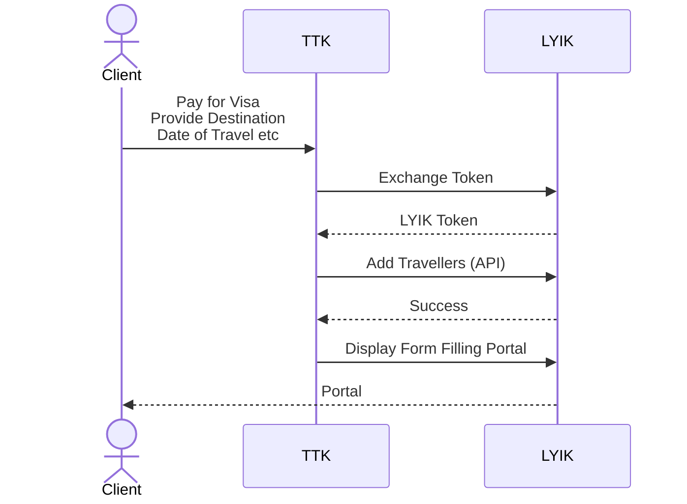

# 7 April 2025
## Meeting Information

**Meeting Date/Time:** 2025-04-07 / 10:30 AM

**Meeting Location:** TTK Office, Marathahalli 

**Note Taker:** Akhil Babu

## Attendees

- Vishnu
- Bhaskar
- Deepak K
- Akhil Babu
- Suveer N
## Agenda Items

1. Set the necessary user experience and functionality across the three portals.
	1. Address the main stakeholders in the entire journey
	2. Talk about the 3 stakeholders in 3 portal areas
2. Get the Details so no surprises in Future.
	1. Get clarifications on what should be done
3. Project plan for retail deliverable
4. Discuss Soft Launch

## Discussion Items

### Stakeholders
The following are the main human stake holders
1. **Client** = Traveller
2. **Maker** = TTK Employee who fills the form
3. **Checker** = TTK Employee who validates data
`Maker` and `Checker` make up the `4 Eyes` of the system
#### Client
- Can edit, upload data and do any modifications to the form
- Has permissions to `Submit` (aka `Good to file`) the form
#### Maker
- Can see all forms submitted by any `client`
- Can edit, upload data or perform any modifications to the form
- Has permissions to `Submit` (aka `Good to file`)
- There are some corner cases where the client will just send the necessary documents to the maker, and ask the latter to `Submit`
#### Checker
- Can only view and review
- Cannot edit any data
	- Checker will go through the submitted form, make sure the data is correct, and then allow it to go through the next steps of the flow
### Portals
1. TTK Portal
	1. This is the portal where `Client` will visit
	2. This is the single entry point to the entire system comprising TTK and LYIK solutions
2. Form filling Portal used for client
	1. This is the LYIK application
	2. Customer will login to the TTK portal and from there can navigate to the LYIK portal
	3. The `Client` can navigate only after having purchased any of the TTK services (such as Visa)
3. Maker checker portal (for internal team)

### Retail and Corporate
There are lot of similarities between `Retail` and `Corporate` journeys.
The difference will mostly be in the area of generating artifacts such as `Invitation Letter`, `Covering Letter` and the like
The `Corporate` journey will be discussed in detail when the time is right for that

Some discussion points
1. Retail 
	1. Upfront payment
	2. Actors: Ttk, Client

2. Corporate:
	1. Upfront payment is not needed. Settlement between TTK and the Corporate
	2. Actors: Employee, Employer
	3. Domain based login
3. Aspects:
	1. Checklist
	2. Timeline
	3. Application Form
	4. Letters
		1. Invitation Letter
		2. Cover Letter
		3. Templatised for company, country
### Domain
Don't use `sub domains` inside. Navigation has to be through `URL path` variables
1. ttkvisas.in = TTK portal
2. ttkvisas.in/visaforms = LYIK Portal (Example path for all lyik endpoints in ui)

### Client User Experience on the Portal

- The `Client` will not see the background exchange of messages between TTK and LYIK
- Behind the scenes TTK is logging the client into the LYIK portal through exchange of Tokens
- Since the TTK portal knows exactly the number of travellers and some details, the records are initially created in the LYIK portal through API invocation
- After a successful creation of TTK portal will invoke the LYIK portal (not API) to show the form filling portal. Here the token will be passed to LYIK
- The `Client` will always get to see a list of travellers. This is where the form filling journey starts

### Checklist
1. B2C `Fn(from_country, to_country, visa_type)`
2. B2B. `Fn(from_country, to_country, visa_type, corporate)`

#### Facts about Checklist
- Checklist is the single most important document in TTK
- It contains information about the `data` that is needed for a particular Visa and also the `rules` for processing the data
	- Currently (as of writing this note) the rules are all in the `minds` of the SMEs
	- This will be gradually documented
#### About additional documents
Although the checklist contains information of all data, there will be cases where the SME decides (based on their prior experience) that certain documents will be needed which are not part of the checklist. To cover for such cases LYIK forms will contain a `group` field which can accept any number of extra documents. Each document can have a `title` and `description` field which the SME (`maker`) can use to indicate the reasoning for asking for extra documents.

### User Experience Discussion
1. Arrive to TTK portal
2. Login
3. Make Payment, Create New Order
4. New Order goes to Lyik Portal
5. The Lyik Portal Will not have the header or footer of TTK Portal
	1. Lyik Portal will have its own header with TTK design, logo and "Go to Dashboard" button.
	2. Lyik Portal will have no logout button, or any header links from TTK.
	3. Lyik Portal will have "Go to Dashboard" button, to go back to TTK Portal
6. Maker/Client will duplicate documents across the order, if the same document is relevant for co-travellers.

	**Addons:**
		1. Courier, Travel/Document pickup, Insurance, ticket, hotel account, photo dev charges.
		2. We will have this in a single location, at the bottom. 
		3. The addon selections can be across sections, but the consolidated view of all selected addons are in a single section.
		4. User cannot uncheck anything from this addon section.

### Addon and Payments
1. Client selects the addons in Lyik Portal.
2. Lyik Portal Accepts payment for each traveller separately.
3. Payment Gateway integration (Razorpay)
### General:
1. Freeze the Form in next meeting
2. Have indication of who the traveller is on the UI